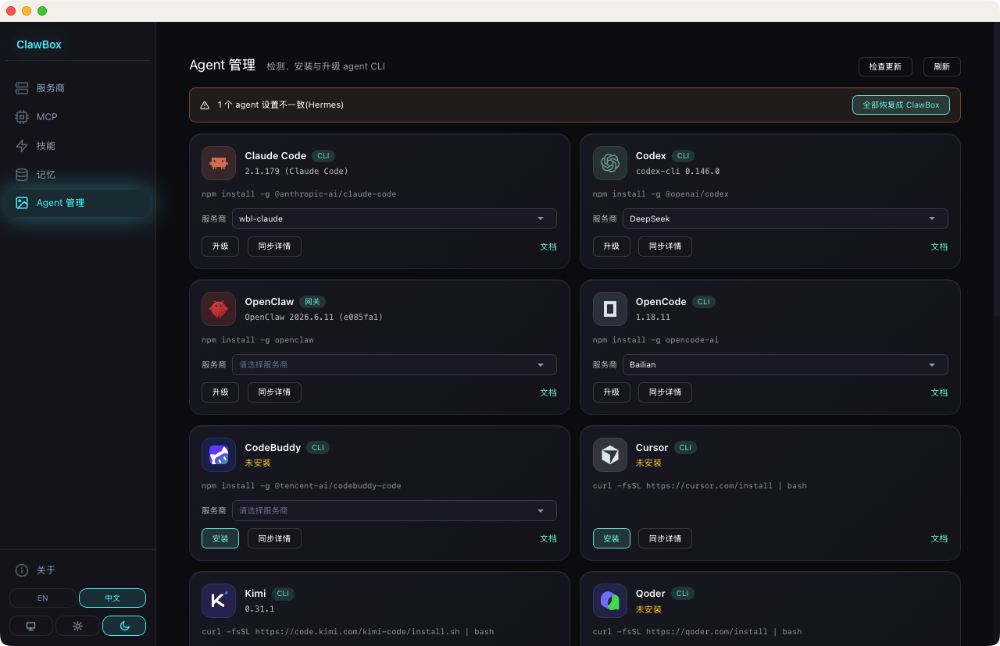

<div align="center">
  
  <h1>ClawBox</h1>
  <p><strong>Centro de configuración unificado para agentes de IA</strong></p>
  <p>Gestiona proveedores, servidores MCP, habilidades y memoria en un solo lugar: sincroniza con cada agente con un solo clic.</p>
  <p>
    <a href="LICENSE"></a>
    <a href="https://github.com/zhaolianghz/clawbox/releases"></a>
    <a href="https://github.com/zhaolianghz/clawbox/issues"></a>
  </p>
  <p>
    <a href="README.md">Inglés</a> · <a href="README.zh.md">Chino</a>
  </p>
</div>

---

## ¿Qué es ClawBox?

ClawBox es una aplicación de escritorio (macOS · Windows · Linux) que te proporciona un panel de control único para todos tus agentes de programación con IA: Claude Code, Codex, Hermes, OpenCode, OpenClaw, Kimi, CodeBuddy y más.

En lugar de editar archivos de configuración en cinco directorios diferentes, configuras una vez en ClawBox y lo envías a todos los agentes simultáneamente.

## Capturas de pantalla


| MCP | Habilidades |
|---|---|
|  |  |
| **Memoria** | **Gestión de Agentes** |
|  |  |

## Características

| Módulo | Funcionalidad |
|---|---|
| **Proveedores** | Agrega claves API y puntos de conexión para cualquier proveedor compatible con OpenAI o Anthropic (78 integrados, dos puntos de conexión por proveedor). Elige un proveedor por agente: la selección se aplica al instante y los cambios se reimplantan automáticamente. |
| **MCP** | Gestiona servidores MCP con un editor visual (formulario o JSON sin procesar). Sincroniza con todos los agentes que admiten MCP. 8 servidores seleccionados para una configuración rápida. |
| **Habilidades** | Biblioteca de habilidades unificada respaldada por `~/.agents/skills/`. Instala desde repositorios Git (Anthropic Skills, Superpowers, …), adopta habilidades existentes de cualquier agente, sincroniza mediante enlaces simbólicos. |
| **Memoria** | Edita un único archivo `~/.agents/memory/MEMORY.md` e injértalo como un bloque gestionado en el archivo de instrucciones de cada agente — sin tocar nada fuera del bloque. |
| **Agentes** | Instala, actualiza e inspecciona todos tus agentes CLI de IA desde una sola pantalla. |

## Fallback de proveedores y resolución de desviaciones

**Cadena de respaldo (Hermes).** Vincula un proveedor principal junto con una lista ordenada de respaldos. Cuando el principal alcanza el límite de velocidad o genera un error, Hermes intenta automáticamente el siguiente — sin puerta de enlace, sin daemon en segundo plano. Arrastra las etiquetas para reordenar la prioridad. Los demás agentes  usan un único punto de conexión en tiempo de ejecución; para ellos, el fallback consiste en apuntar al agente a un proveedor de puerta de enlace.

**Resolución de desviaciones (todos los agentes).** Cuando el archivo de configuración de un agente se desvía de lo que gestiona ClawBox (por ejemplo, lo editaste manualmente o otra herramienta lo modificó), ClawBox nunca lo sobrescribe silenciosamente. La desviación se muestra en lenguaje claro con dos acciones de un solo clic:



- **Restaurar** — enviar el valor de ClawBox de nuevo (el valor predeterminado seguro).
- **Mantener actual** — adoptar el valor actual del agente en ClawBox (sincronización inversa).

Sin tablas de diferencias ni nombres de campos: solo nombres de proveedores y dos botones. Una barra superior ofrece **Restaurar todo** para resolver la desviación de todos los agentes de una vez.

**Adoptar desde agente.** Incorpora directamente a ClawBox el proveedor actualmente activo de cualquier agente (`Adoptar desde agente` en los detalles de sincronización) — útil cuando has configurado un agente manualmente y quieres que ClawBox asuma el control.

## Agentes compatibles

| Agente | Proveedores | MCP | Habilidades | Memoria | Fallback |
|---|---|---|---|---|---|
| Claude Code | ✅ | ✅ | ✅ | ✅ | — |
| Codex | ✅ | ✅ | — | ✅ | — |
| Hermes | ✅ | ✅ | ✅ | ✅ | ✅ |
| OpenCode | ✅ | ✅ | ✅ | ✅ | — |
| OpenClaw | ✅ | ✅ | ✅ | ✅ | — |
| Kimi | ✅ | — | — | — | — |
| CodeBuddy | ✅ | ✅ | — | — | — |
| Cursor | — | ✅ | — | — | — |
| Qoder | — | — | — | — | — |
| Gemini | ✅ | ✅ | — | — | — |
| Cline | ✅ | ✅ | — | — | — |
| Pi | ✅ | — | — | — | — |
| DeepSeek Harness | ✅ | — | — | — | — |
| Qwen Code | — | ✅ | — | — | — |

*La resolución de desviaciones (restaurar / adoptar) funciona para la dimensión de Proveedores en todos los agentes anteriores. La cadena de fallback en tiempo de ejecución está disponible actualmente solo para Hermes.*

Para conocer el archivo exacto que escribe cada capacidad y las reglas de seguridad aplicables, consulta **[Transparencia](docs/TRANSPARENCY.md)**.

## Instalación

### Descargar (recomendado)

Descarga el `.dmg` más reciente (macOS) desde [Releases](https://github.com/zhaolianghz/clawbox/releases).

### Compilar desde el código fuente

**Requisitos previos:** Node.js ≥ 18, Rust ≥ 1.77, `npm`

```bash
git clone https://github.com/zhaolianghz/clawbox.git
cd clawbox
npm install
npm run tauri build
# Output: src-tauri/target/release/bundle/
```

**Modo de desarrollo:**

```bash
npm run tauri dev
```

## Inicio rápido

1. Abre ClawBox → **Proveedores** → haz clic en la tarjeta de un proveedor → ingresa tu clave API → Guardar
2. Ve a **Agentes** → selecciona ese proveedor para cada agente — la selección se aplica al instante
3. Listo — Claude Code, Codex y otros ahora utilizan tu proveedor

## Tecnologías

- [Tauri v2](https://tauri.app) (Rust backend + WebView frontend)
- [Svelte 5](https://svelte.dev) con `runes`
- [svelte-i18n](https://github.com/kaisermann/svelte-i18n) (English / 中文)
- Logos de proveedores/agentes de [lobe-icons](https://github.com/lobehub/lobe-icons) (MIT)

## Contribuir

Se aceptan incidencias y solicitudes de incorporación de cambios (PR). Por favor, abre una incidencia primero para cambios significativos.

## Licencia

[MIT](LICENSE) © 2026 ClawBox contributors
