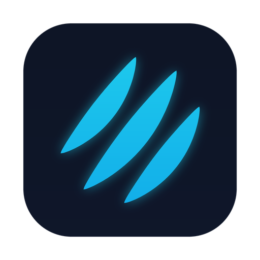
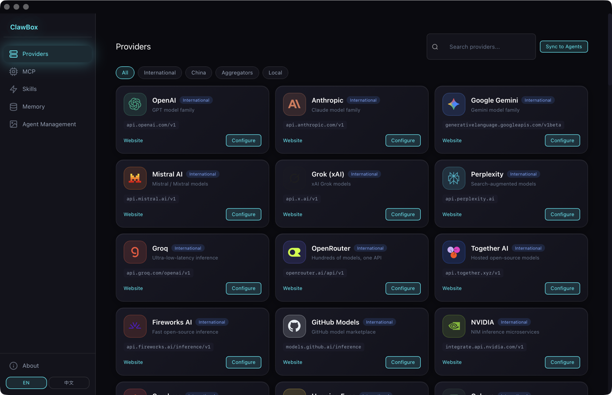
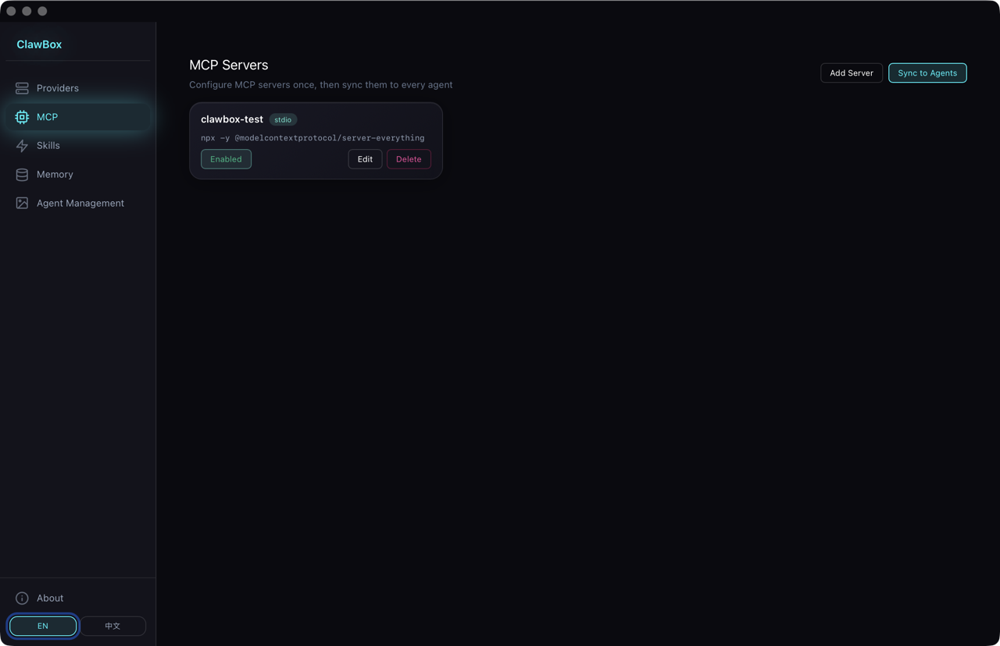
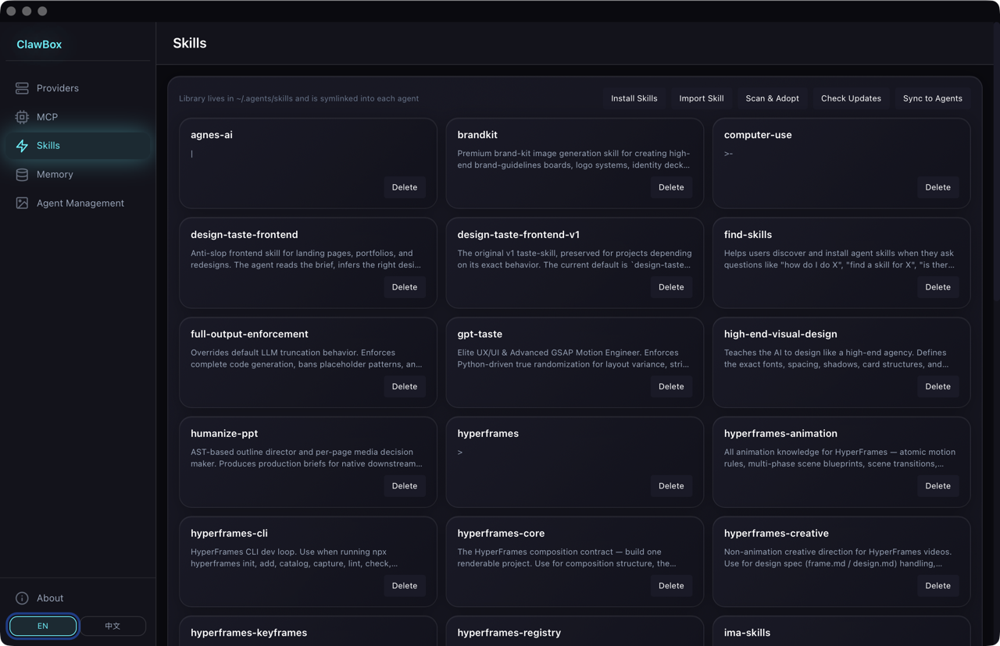
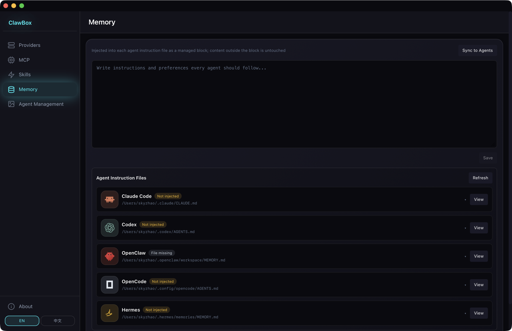
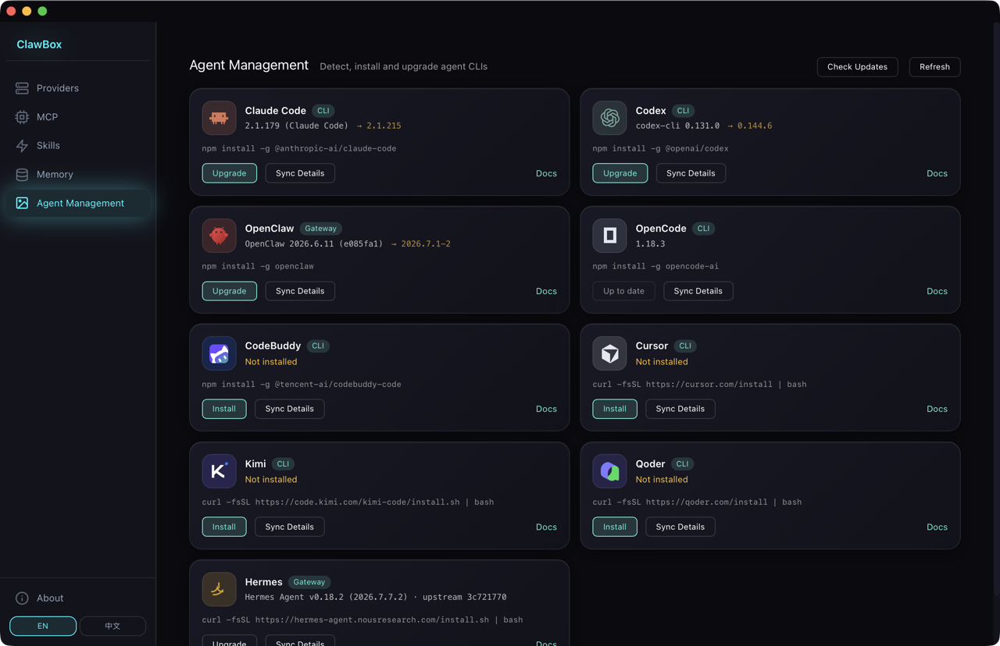

<div align="center">
  
  <h1>ClawBox</h1>
  <p><strong>Unified configuration center for AI agents</strong></p>
  <p>Manage providers, MCP servers, skills and memory in one place — sync to every agent with one click.</p>
  <p>
    <a href="LICENSE"></a>
    <a href="https://github.com/zhaolianghz/clawbox/releases"></a>
    <a href="https://github.com/zhaolianghz/clawbox/issues"></a>
  </p>
  <p>
    <a href="README.md">English</a> · <a href="README.zh.md">中文</a>
  </p>
</div>

---

## What is ClawBox?

ClawBox is a desktop app (macOS · Windows · Linux) that gives you a single control panel for all your AI coding agents — Claude Code, Codex, Hermes, OpenCode, OpenClaw, Kimi, CodeBuddy and more.

Instead of editing config files in five different directories, you configure once in ClawBox and push to every agent simultaneously.

## Screenshots



| MCP | Skills |
|---|---|
|  |  |
| **Memory** | **Agent Management** |
|  |  |

## Features

| Module | What it does |
|---|---|
| **Providers** | Add API keys and endpoints for any OpenAI- or Anthropic-compatible provider (78 built-in, dual-endpoint per provider). Pick a provider per agent — selection applies instantly, edits auto-redeploy. |
| **MCP** | Manage MCP servers with a visual editor (form or raw JSON). Sync to all agents that support MCP. 8 curated servers for quick setup. |
| **Skills** | Unified skill library backed by `~/.agents/skills/`. Install from Git repos (Anthropic Skills, Superpowers, …), adopt existing skills from any agent, sync via symlinks. |
| **Memory** | Edit a single `~/.agents/memory/MEMORY.md` and inject it as a managed block into every agent's instruction file — without touching anything outside the block. |
| **Agents** | Install, upgrade, and inspect all your AI CLI agents from one screen. |

## Supported Agents

| Agent | Providers | MCP | Skills | Memory |
|---|---|---|---|---|
| Claude Code | ✅ | ✅ | ✅ | ✅ |
| Codex | ✅ | ✅ | — | ✅ |
| Hermes | ✅ | ✅ | ✅ | ✅ |
| OpenCode | ✅ | ✅ | ✅ | ✅ |
| OpenClaw | ✅ | ✅ | ✅ | ✅ |
| Kimi | ✅ | — | — | — |
| CodeBuddy | ✅ | ✅ | — | — |
| Cursor | — | ✅ | — | — |
| Qoder | — | — | — | — |

For exactly which file each capability writes and the safety rules that apply, see **[Transparency](docs/TRANSPARENCY.md)**.

## Installation

### Download (recommended)

Grab the latest `.dmg` (macOS) from [Releases](https://github.com/zhaolianghz/clawbox/releases).

### Build from source

**Prerequisites:** Node.js ≥ 18, Rust ≥ 1.77, `npm`

```bash
git clone https://github.com/zhaolianghz/clawbox.git
cd clawbox
npm install
npm run tauri build
# Output: src-tauri/target/release/bundle/
```

**Dev mode:**

```bash
npm run tauri dev
```

## Quick Start

1. Open ClawBox → **Providers** → click a provider card → enter your API key → Save
2. Go to **Agents** → pick that provider for each agent — the selection applies instantly
3. Done — Claude Code, Codex, and others now use your provider

## Tech Stack

- [Tauri v2](https://tauri.app) (Rust backend + WebView frontend)
- [Svelte 5](https://svelte.dev) with runes
- [svelte-i18n](https://github.com/kaisermann/svelte-i18n) (English / 中文)
- Provider/agent logos from [lobe-icons](https://github.com/lobehub/lobe-icons) (MIT)

## Contributing

Issues and PRs are welcome. Please open an issue first for significant changes.

## License

[MIT](LICENSE) © 2026 ClawBox contributors
